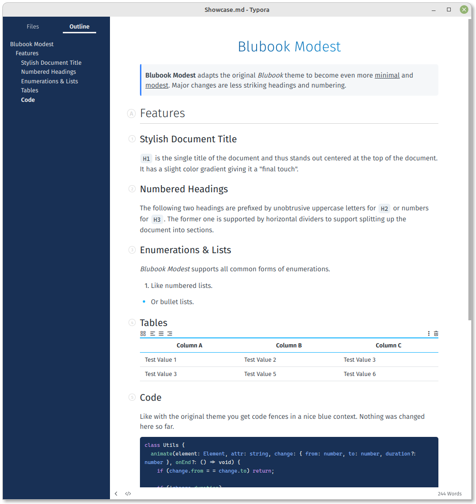

# typora-blubook-modest-theme

> **Note**
> 
> This is a fork of the original [Typora Blubook theme](https://github.com/HanryYu/typora-blubook-theme).
> It slims down the design in size, weight and elements to achieve a little bit more modest appearance.

## Showcase

## Changes to the Original

1. Centered title with slight blue gradient
2. More light-weight headings (smaller and thinner)
3. Unobtrusive numbers and letters prefixing headings
4. Wider content box
5. Tables with centered headings only separated by row borders